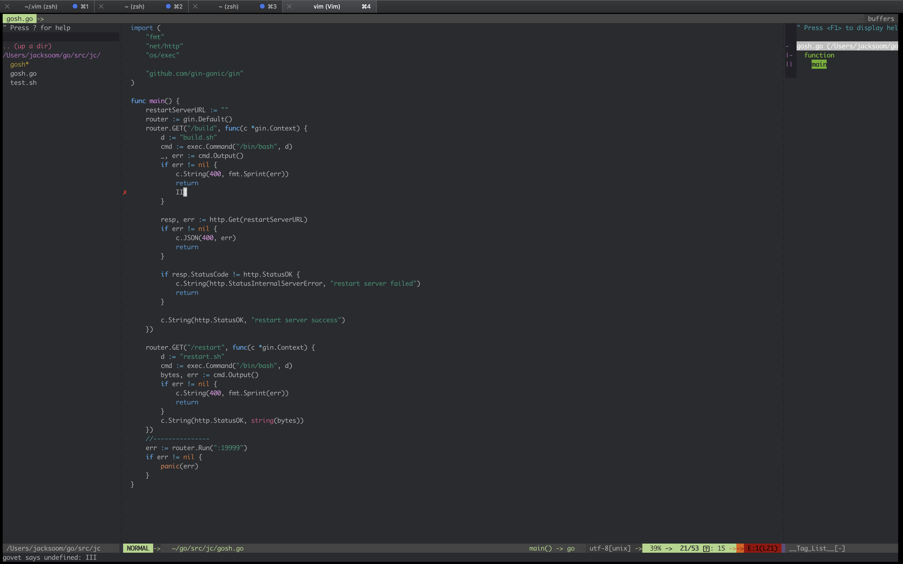

## Description 
   perfect support Go and Rust, and used some perfect Plugin (universal-ctags,YouCompleteMe, airline, fzf and so on.), enjoy it!

## Install
```sh
    $ln -s $PROJ/init.vim $HOME/.vimrc
    $ln -s $PROJ/ $HOME/.vim
    $vim  #install some vundle package ,  :VundleInstall
    $ #you should modify the binary file URL of my personal relative paths in the .vimrc
```


## Preview

